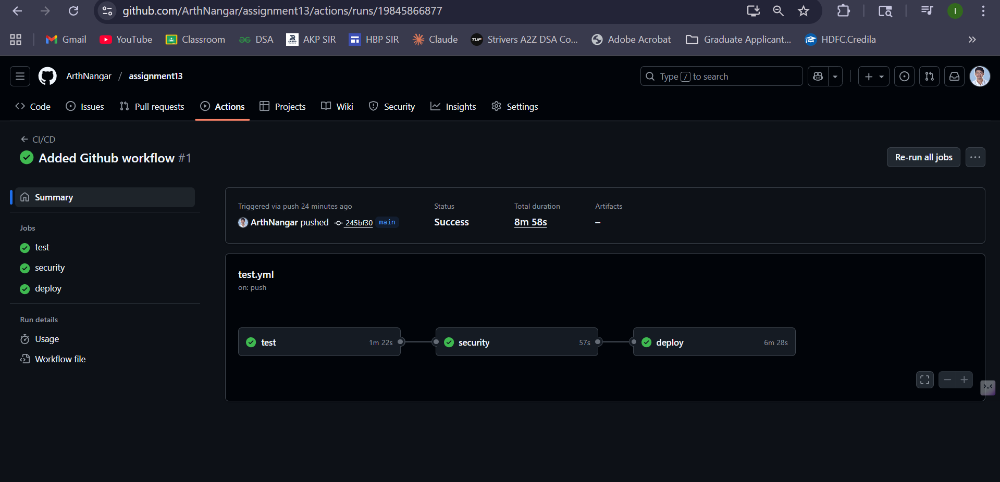
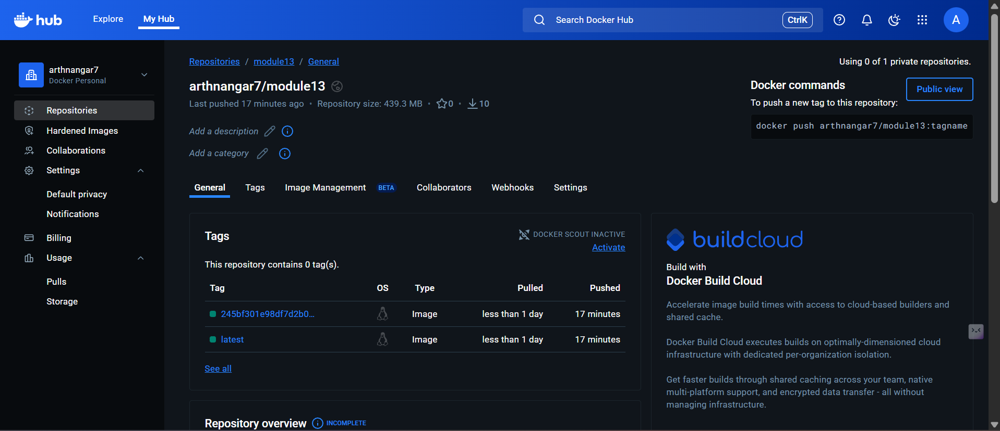
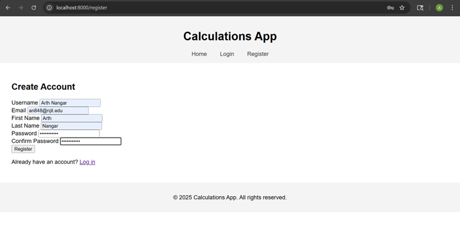
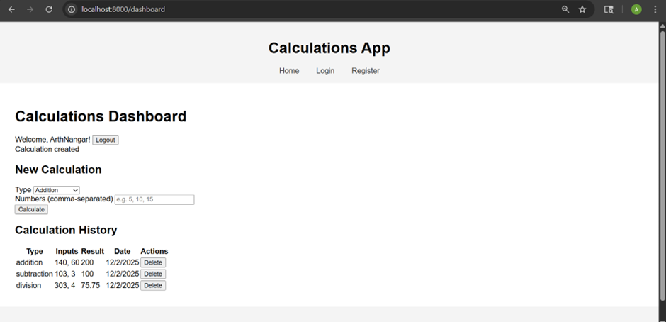

# Assignment 13 – JWT Authentication, Front-End Login/Registration, Playwright E2E & CI/CD  
This project implements WT-based authentication, complete registration/login front-end pages, and Playwright end-to-end tests, integrated with a full CI/CD pipeline using GitHub Actions and Docker.  


## Features Implemented

### **✅ JWT Authentication**
- `/auth/register` – create user with hashed password
- `/auth/login` – return access token (JWT)
- Pydantic validation for user input
- FastAPI dependency system for authentication
- Token stored in frontend (localStorage)
- Secure password hashing using passlib


##  Project Structure

```

.github/
 └── workflows/test.yml
.vscode/settings.json
app/
 ├── auth/
 │    ├── __init__.py
 │    ├── dependencies.py
 │    ├── jwt.py
 │    └── redis.py
 ├── core/
 │    ├── __init__.py
 │    └── config.py
 ├── models/
 │    ├── __init__.py
 │    ├── calculation.py
 │    └── user.py
 ├── operations/
 │    ├── __init__.py
 │── schemas/
 │    ├── __init__.py
 │    ├── base.py
 │    ├── calculation.py
 │    ├── token.py
 │    └── user.py
 ├── templates/
 │    ├── layout.html
 │    ├── register.html
 │    ├── login.html
 │    ├── dashboard.html
 │    └── index.html
 ├── static/css/style.css
 ├── static/js/script.js
 ├── database.py
 ├── database_init.py
 ├── main.py
 └── __init__.py
tests/
 ├── e2e/
 ├── integration/
 └── unit/
docker-compose.yml  
Dockerfile  
pytest.ini  
init-db.sh  
requirements.txt  
README.md  

```

## 🚀 Getting Started

### Prerequisites

- Python 3.10 or higher
- Docker Desktop
- Node.js 18+ (for Playwright)
- Git

### Installation

#### Option 1: Docker Setup

1. **Clone the repository**
   ```bash
   git clone https://github.com/ArthNangar/assignment13.git
   cd assignment13
   ```

2. **Start the application with Docker Compose**
   ```bash
   docker-compose up --build
   ```

3. **Access the application**
   ```bash 
     http://localhost:8000/

#### Local Setup

1. **Clone the repository**
   ```bash
   git clone  https://github.com/ArthNangar/assignment13.git
   cd assignment-13
   ```

2. **Create and activate virtual environment**
   ```bash
   # Mac/Linux
   python3 -m venv venv
   source venv/bin/activate

   # Windows
   python -m venv venv
   venv\Scripts\activate
   ```

3. **Install Python dependencies**
   ```bash
   pip install -r requirements.txt
   ```
4. **Build Docker image:**
   ```bash
   docker compose build

   docker compose up

   Services:
   FastAPI backend → http://localhost:8000

   Stop:
   docker compose down --volumes


## Automated Testing

### **1. Pytest**
- Unit tests (operations, utilities)
- Integration tests (models, schemas, dependencies)
- E2E API tests (auth + calculations)
- Test coverage included


## Screenshots

### ✅ GitHub Actions – Successful CI/CD Run


### 🐳 Docker Hub – Image Successfully Pushed


### Frontend Register Page


### Frontend Dashboard Page



##  License
This project is licensed under the MIT License.
See LICENSE for details.

## Acknowledgments

FastAPI Documentation

Docker Docs

PostgreSQL Docs

pgAdmin Docs


## 👨‍💻 Author
Arth Nangar

Date: 12/01/2025

Module 13